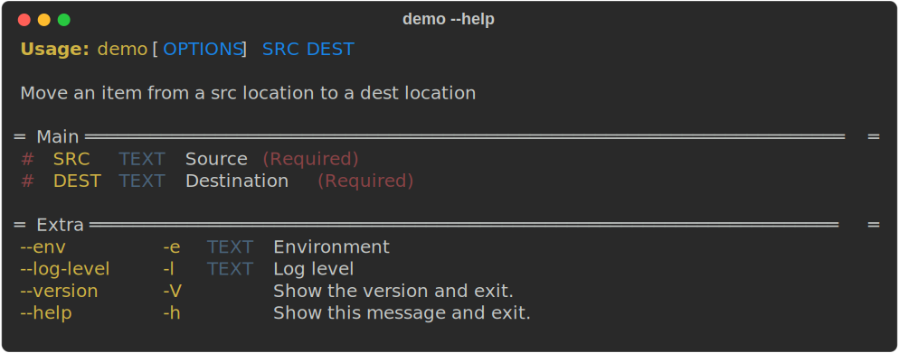
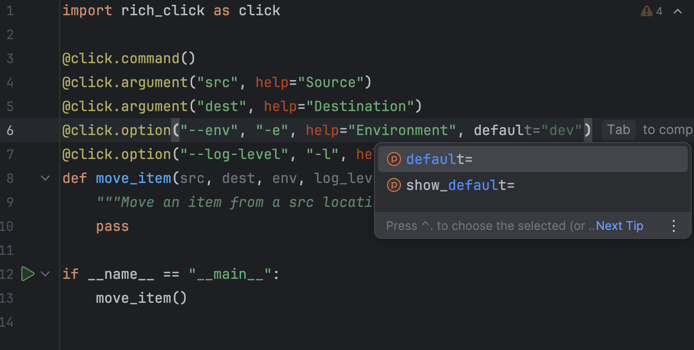
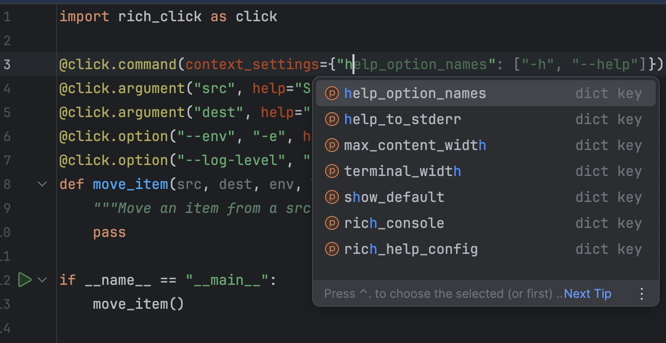

# v1.9 released!

Today we are excited to release version 1.9 of **rich-click**, our biggest release yet with lots of amazing new features!

<!-- more -->

## Themes

The biggest theme (pun intended) of **rich-click** 1.9 is **themes**. These can be set with an env var (as an end user) or in the `@click.rich_config()` (as a developer).

Here are some simple examples of themes:

=== "`quartz-modern`"

    ```shell
    export RICH_CLICK_THEME=quartz-modern
    python hello_rich.py --help
    ```

    {.screenshot}

=== "`nord-nu`"

    ```shell
    export RICH_CLICK_THEME=nord-nu
    python hello_rich.py --help
    ```

    {.screenshot}

=== "`cargo-slim`"

    ```shell
    export RICH_CLICK_THEME=cargo-slim
    python hello_rich.py --help
    ```

    {.screenshot}

=== "`forest-robo`"

    ```shell
    export RICH_CLICK_THEME=forest-robo
    python hello_rich.py --help
    ```

    {.screenshot}

As you can see, themes are not _just_ colors, they can also completely change the formatting, too!

Themes are defined as `{color_pallete}-{format}`. Overall, there are over **100 themes** to choose from.

If you want to see all the options available to you, you can run the CLI command `rich-click --themes`:

??? info "Output of `rich-click --themes`"

    {.screenshot}


If you are interested in learning more about themes, read about them in [the **Themes** docs](https://ewels.github.io/rich-click/1.9/documentation/panels/).


## Panels

Panels are the second new feature of **rich-click**, and bring along with it an intuitive and powerful API for customization.

Panels replace the old "groups" feature of previous **rich-click** versions. (Don't worry, your old code will still work just fine.)
This is something I've wanted in **rich-click** for a long time, as I've always found the old groups API powerful but a little hard to use.

With the new API, defining a panel is as simple as adding a decorator.

```python
import rich_click as click

@click.command()
@click.argument("src", help="Source", panel="Main")
@click.argument("dest", help="Destination", panel="Main")
@click.option("--env", "-e", help="Environment", panel="Extra")
@click.option("--log-level", "-l", help="Log level", panel="Extra")
@click.version_option("1.2.3", "--version", "-V", panel="Extra")
@click.help_option("--help", "-h", panel="Extra")
@click.option_panel("Main")
@click.option_panel("Extra")
@click.rich_config({"theme": "star-nu", "max_width": 80})
def move_item(src, dest, env, log_level):
    """Move an item from a src location to a dest location"""
    pass

if __name__ == "__main__":
    move_item()
```

{.screenshot}

You can also define the objects mapped to a panel in the panel itself.
The below code is effectively equivalent to the above code:

```python
import rich_click as click

@click.command(context_settings={"help_option_names": ["--help", "-h"]})
@click.argument("src", help="Source")
@click.argument("dest", help="Destination")
@click.option("--env", "-e", help="Environment")
@click.option("--log-level", "-l", help="Log level")
@click.version_option("1.2.3", "--version", "-V")
@click.help_option("--help", "-h")
@click.option_panel("Main",
                    options=["src", "dest"])
@click.option_panel("Extra",
                    options=["--env", "--log-level", "--version", "--help"])
@click.rich_config({"theme": "star-nu", "max_width": 80})
def move_item(src, dest, env, log_level):
    """Move an item from a src location to a dest location"""
    pass

if __name__ == "__main__":
    move_item()
```

The below is a fairly convoluted example of panels, which shows off the level of customizability available:

```python
import rich_click as click

@click.command()
@click.argument("src", help="Source", panel="Main")
@click.argument("dest", help="Destination", panel="Main")
@click.option("--env", "-e", help="Environment", panel="Extra")
@click.option("--log-level", "-l", help="Log level", panel="Extra")
@click.version_option("1.2.3", "--version", "-V", panel="Extra")
@click.help_option("--help", "-h", panel="Extra")
@click.option_panel("Main",
                    title_style="bold red",
                    help="Required arguments",
                    help_style="dim red",
                    columns=["opt_all", "metavar", "help"],
                    panel_styles={"border_style": "dim red"})
@click.option_panel("Extra",
                    title_style="bold blue",
                    help="Optional settings",
                    help_style="dim blue",
                    columns=["opt_all", "metavar", "help"],
                    panel_styles={"border_style": "dim blue"})
@click.rich_config({"theme": "star-nu", "max_width": 80})
def move_item(src, dest, env, log_level):
    """Move an item from a src location to a dest location"""
    pass

if __name__ == "__main__":
    move_item()
```

{.screenshot}

Neat, huh? If you are interested in learning more, read about panels in [the **Panels** docs](https://ewels.github.io/rich-click/1.9/documentation/panels/).

## IDE autocomplete support

I love Click! That's why we maintain this repo, after all. That said, one thing that is a nuisance with Click is that it doesn't have great type annotations for its core API, meaning your IDE doesn't autocomplete args for Click decorators.

Well, we have fixed this issue in **rich-click** 1.9.0:

{.screenshot}

We even typed the more opaque dicts, such as `context_settings`:

{.screenshot}

Adding a feature like this is somewhat outside of the intended scope of **rich-click**, but we feel it is such a huge quality of life upgrade for the developer experience that we'd be silly to not add it. You're welcome!

## Other cool features

### Help for arguments: `@click.argument(..., help=)`

That's right! We now support a `help` kwarg for arguments.

### `rich-click` CLI supports `path/to/file.py`

Now, all the following ways of invoking the `rich-click` CLI are supported:

- `rich-click hello:cli --help`
- `rich-click hello.py --help`
- `rich-click hello --help`

In prior versions, only the first way worked.

### `rich-click` CLI support for Typer CLIs

<!-- todo --> Maybe?

### Stderr help: `context_settings={"help_to_stderr": True}`

Print help text to stderr with a context setting!

### Deferred help text rendering

Like normal Click, now help text is pushed to a buffer and rendered at the very end of the help text generation context.
Most users won't notice a difference, but it makes help text rendering atomic (e.g. in the event of an error), and also assists with integrating into tools such as [mkdocs-click](https://github.com/mkdocs/mkdocs-click).

### Many other minor improvements

There have been so many tiny changes to **rich-click** over the past few months that I've lost count.
We've added more than a dozen different config options, we've fixed a few minor bugs, we've improved performance slightly, and we've made everything more composable for the really advanced users who want to subclass **rich-click**'s objects.

## Dropped support

In **rich-click** 1.9, we finally pulled the plug on Python 3.7, Click 7, and Rich 10+11.

We are being a little more conservative than we perhaps need to: Click 8 came out in 2021, Rich 12 came out in 2022, and Python 3.8 came out in 2019 and hit end-of-life in 2024.
That said, we don't believe there is a major cost to supporting these other than some slightly ugly backend code here and there, so we'll continue to be conservative with dropping support.

## Plans for the future

Our short term plan is to monitor issues aggressively over the next month to patch any problems people encounter with **rich-click** 1.9.
Please submit issues on Github if you encounter any strange behavior! We appreciate your assistance in making **rich-click** as robust as it can be.

In [the 1.8 release blog post](https://ewels.github.io/rich-click/latest/blog/2024/04/30/version-1.8/),
we said we anticipated 1.9 coming out by end of year 2024. Oops!
Making promises about when things will happen is hard, especially when work and personal obligations get in the way.
So, I won't make the same mistake again: we have no promises or hints for when a 1.10 (or a 2.0?) will release.
We do have [a roadmap](https://github.com/ewels/rich-click/issues/275) in place for **1.10**, so we have a good sense of what we want out of future releases.
Will that be next year, or the year after? Will the roadmap change substantially when that time comes? It's tough to say!

The ultimate goal of **rich-click** is to become the most beautiful CLI help text generator out there.
Nearing the end of development for 1.9, I couldn't help but think of all the ways we can continue to improve on that.
For example, a big limitation of themes are that they all use ANSI colors.
There are a lot of reasons for this decision, and it's not made lightly.
But sometime in the future, I'd really like to move away from this; maybe we can get proper solarized, dracula, nord, material, onedark, and gruvbox themes in?
However, achieving this may ultimately require a **2.0** release, and we're quite far from that.

But, why spend so much time dwelling on the future, when the present state of things is so great and we've barely had time to enjoy it?
We're **_extremely_** happy with where 1.9 leaves **rich-click**! And we hope you agree!

Thank you once again for using **rich-click**! ❤️❤️❤️❤️❤️
